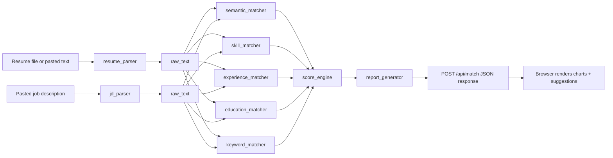

# Scanline — ATS Resume Matcher

A full-stack ATS resume matcher built with **FastAPI** and a **vanilla JavaScript frontend**. The application evaluates resumes against job descriptions using semantic similarity, skill matching, experience, education, and keyword coverage.ess

---

## Table of Contents

1. [Project Overview](#1-project-overview)
2. [The Five Matching Dimensions](#2-the-five-matching-dimensions)
3. [System Architecture](#3-system-architecture)
4. [Project Structure](#4-project-structure)
5. [Request Flow (Input → Output)](#5-request-flow-input--output)
6. [Scoring Methodology](#6-scoring-methodology)
7. [API Reference](#7-api-reference)
8. [Frontend](#8-frontend)
9. [Installation & Setup](#9-installation--setup)
10. [How to Run & Demonstrate](#10-how-to-run--demonstrate)
11. [Sample Output](#11-sample-output)
12. [Technologies Used](#12-technologies-used)
13. [Known Issues & Gaps](#13-known-issues--gaps)
14. [Limitations & Future Work](#14-limitations--future-work)
15. [Viva Q&A Cheat Sheet](#15-viva-qa-cheat-sheet)

---

## 1. Project Overview

**Scanline** is an **Applicant Tracking System (ATS) Resume Matcher**. A user pastes or uploads a resume and pastes a job description (JD) into a browser page; the backend parses both, scores the match across five weighted dimensions, and the frontend renders the result as a gauge, bar chart, pie chart, radar chart, and a list of concrete improvement suggestions.

### Problem It Solves

Recruiters and job seekers often struggle to understand why a resume passes or fails automated screening. Scanline simulates ATS-style matching by:

- Parsing resume and JD text from common file formats
- Comparing skills, experience, education, and keywords
- Computing a weighted overall match score
- Generating actionable suggestions to improve the resume

### Key Design Principles

| Principle | Description |
|-----------|-------------|
| **Local-first** | Runs entirely on your machine — no API keys, no third-party AI calls |
| **Modular** | Each scoring dimension is a separate, independently testable module |
| **Transparent** | Every score is broken down with matched/missing skills and suggestions |
| **Single-origin** | FastAPI serves the static frontend directly, so there's nothing extra to deploy |

---

## 2. The Five Matching Dimensions

```
┌─────────────────────────────────────────────────────────────┐
│                    OVERALL MATCH SCORE                       │
│                         (0–100)                              │
└─────────────────────────────────────────────────────────────┘
         ▲         ▲         ▲         ▲         ▲
         │         │         │         │         │
    ┌────┴───┐ ┌───┴───┐ ┌───┴───┐ ┌───┴───┐ ┌───┴───┐
    │Semantic│ │Skills │ │Exper. │ │Educat.│ │Keyword│
    │  40%   │ │  25%  │ │  15%  │ │  10%  │ │  10%  │
    └────────┘ └───────┘ └───────┘ └───────┘ └───────┘
```

| Dimension | Weight | What It Measures | Module |
|-----------|--------|-------------------|--------|
| **Semantic Similarity** | 40% | TF-IDF (1–2 gram) cosine similarity between resume and JD text | `semantic_matcher.py` |
| **Skills Match** | 25% | % of JD-required skills (from a curated taxonomy) found in the resume | `skill_matcher.py` + `skills_data.py` |
| **Experience Match** | 15% | Years of experience (70 pts) + job-title equivalence (30 pts) | `experience_matcher.py` |
| **Education Match** | 10% | Degree level comparison (Bachelor's / Master's / PhD) | `education_matcher.py` |
| **Keyword Coverage** | 10% | How many of the JD's top-30 TF-IDF keywords appear in the resume | `keyword_matcher.py` |

---

## 3. System Architecture

The project is a standard two-tier web app: a FastAPI backend that does all parsing/scoring, and a static frontend that calls it over HTTP and renders the results with Chart.js.

```
Browser (docs/index.html)
   │  fetch("/api/match", FormData: jd_text, resume_file | resume_text)
   ▼
FastAPI app (backend/main.py)
   │
   ├─ resume_parser.parse_resume()        (PDF/DOCX/TXT → text, name, email, phone, sections)
   ├─ jd_parser.parse_job_description()   (splits Required vs Preferred blocks)
   │
   ├─ semantic_matcher.semantic_similarity()   ─┐
   ├─ skill_matcher.match_skills()              │  5 independent
   ├─ experience_matcher.match_experience()     │  scoring modules
   ├─ education_matcher.match_education()       │
   ├─ keyword_matcher.keyword_coverage()        ─┘
   │
   ├─ score_engine.compute_overall_score()   (weighted sum → 0-100 + level)
   └─ report_generator.build_report()        (assembles final JSON incl. strengths/suggestions)
   │
   ▼
JSON response ──► rendered in-browser as gauge / bars / pie / radar / suggestion list
```

### Data Flow Diagram



---

## 4. Project Structure

```
ats-resume-matcher/
├── backend/
│   ├── main.py                  ← FastAPI app, POST /api/match, GET /api/health, static mount
│   ├── resume_parser.py         ← PDF/DOCX/TXT extraction, name/email/phone, section split
│   ├── jd_parser.py             ← locates "Required" vs "Preferred" blocks in JD text
│   ├── skills_data.py           ← skill taxonomy (9 categories, 62 canonical skills, synonyms)
│   ├── skill_matcher.py         ← word-boundary skill matching, matched/missing/extra
│   ├── semantic_matcher.py      ← TF-IDF cosine similarity (Sentence-Transformers optional)
│   ├── experience_matcher.py    ← years-of-experience regex, title groups, leadership words
│   ├── education_matcher.py     ← degree-level extraction and comparison
│   ├── keyword_matcher.py       ← TF-IDF top-30 JD keyword coverage
│   ├── score_engine.py          ← fixed weights (40/25/15/10/10) → overall score + level
│   ├── report_generator.py      ← builds strengths list + actionable suggestions
│   └── app/                     ← ⚠️ in-progress rewrite, not imported by main.py — see §13
│       ├── parsers/resume_parser.py
│       ├── parsers/jd_parser.py
│       └── data/skills_taxonomy.py
│
└── docs/                        ← static frontend, served by FastAPI at "/"
    ├── index.html               ← upload/paste form + results dashboard
    ├── script.js                ← drives the /api/match call and renders every chart/list
    ├── chartManager.js          ← thin wrapper around Chart.js (create/destroy per canvas)
    └── style.css                ← dark "scanline" themed styling
```

### File Purpose Reference

| File / Folder | Purpose |
|---------------|---------|
| `backend/main.py` | FastAPI entry point: defines `POST /api/match`, `GET /api/health`, CORS, and mounts the frontend as static files |
| `backend/resume_parser.py` | Extracts text from PDF (`pdfplumber`) / DOCX (`python-docx`) / TXT, guesses name via heuristics, regex-extracts email/phone, splits into sections |
| `backend/jd_parser.py` | Finds the "Requirements"/"Preferred" blocks in the JD by locating marker phrases |
| `backend/skills_data.py` | Central skill taxonomy: 9 categories, 62 canonical skills, synonym map (e.g. `K8s` → `Kubernetes`) |
| `backend/skill_matcher.py` | Regex word-boundary skill detection; returns matched/missing/extra skills and a 0–100 score |
| `backend/semantic_matcher.py` | TF-IDF + cosine similarity (scikit-learn); Sentence-Transformers path is written but disabled by default (`USE_SENTENCE_TRANSFORMERS = False`) |
| `backend/experience_matcher.py` | Regex for "X years"; predefined title-equivalence groups; leadership-verb detection |
| `backend/education_matcher.py` | Maps degree keywords to levels 1–3 and scores the gap |
| `backend/keyword_matcher.py` | TF-IDF top-30 JD terms vs. resume token coverage |
| `backend/score_engine.py` | Applies fixed weights and classifies the result into Excellent/Good/Moderate/Low |
| `backend/report_generator.py` | Merges all five results into the final JSON, plus `strengths` and `suggestions` lists |
| `docs/index.html` | Single-page UI: dropzone/textarea inputs, gauge + bar/pie/radar charts, strengths/missing/suggestions panels |
| `docs/script.js` | Wires up the form, calls `/api/match`, and populates every element in `index.html` from the response |
| `docs/chartManager.js` | Small helper that creates/destroys Chart.js instances per canvas ID |

---

## 5. Request Flow (Input → Output)

| Step | Input | Processing | Output |
|------|-------|------------|--------|
| 1 | Resume file or pasted text (multipart form field `resume_file` or `resume_text`) | `parse_resume()` uses pdfplumber/python-docx to extract text; regex finds email/phone; text is split into sections | `{ raw_text, name, email, phone, sections }` |
| 2 | JD plain text (form field `jd_text`) | `parse_job_description()` finds "Requirements" and "Preferred" blocks | `{ raw_text, required_block, preferred_block }` |
| 3 | Both raw texts | `semantic_similarity()` builds TF-IDF vectors, computes cosine similarity | `{ score: 0–100, method: "tfidf-cosine" }` |
| 4 | Both raw texts | `match_skills()` scans against the 62-skill taxonomy (with synonyms) | `{ matched, missing, missing_by_category, extra, score }` |
| 5 | Both raw texts | `match_experience()` regex for "X years", title groups, leadership verbs | `{ resume_years, required_years, leadership_detected, score }` |
| 6 | Both raw texts | `match_education()` maps degree keywords to levels 1–3 | `{ resume_degree, required_degree, score }` |
| 7 | Both raw texts | `keyword_coverage()` TF-IDF top-30 JD keywords vs. resume tokens | `{ top_keywords, covered_keywords, score }` |
| 8 | All 5 scores | `compute_overall_score()` applies fixed weights → match level | `{ overall_score, match_level, weights }` |
| 9 | All results | `build_report()` merges everything and generates suggestions | Final report dict, returned as JSON |
| 10 | JSON response | `docs/script.js` renders it into the gauge, bars, pie chart, radar chart, and suggestion list | Visual dashboard in the browser |

### Match Level Thresholds

| Score Range | Level |
|-------------|-------|
| 85 – 100 | Excellent |
| 70 – 84 | Good |
| 50 – 69 | Moderate |
| 0 – 49 | Low |

---

## 6. Scoring Methodology

### 6.1 Semantic Similarity (40%)

- **Method:** TF-IDF vectorization with English stop words and 1–2 gram features (`scikit-learn`)
- **Metric:** Cosine similarity between resume and JD vectors, scaled to 0–100
- **Optional upgrade:** `USE_SENTENCE_TRANSFORMERS = True` in `semantic_matcher.py` switches to `all-MiniLM-L6-v2` embeddings (requires downloading the model from Hugging Face, so it needs internet access at least once)

### 6.2 Skills Match (25%)

- **Taxonomy:** 62 canonical skills across 9 categories (Programming, Frontend, Backend, Cloud, DevOps, Database, AI, Monitoring, Messaging) — 82 total surface forms once synonyms are included
- **Synonyms:** e.g. `K8s` → `Kubernetes`, `JS` → `JavaScript`, `GCP` → `Google Cloud Platform`, `AI` → `Artificial Intelligence`
- **Matching:** regex word-boundary search, longest surface forms matched first so multi-word skills (e.g. "Google Cloud Platform") aren't shadowed by shorter ones (e.g. "GCP")
- **Score:** `(matched skills / JD skills) × 100`

### 6.3 Experience Match (15%)

- **Years (70 pts):** regex extracts "X years" from both documents; proportional score if resume years < required
- **Titles (30 pts):** compares against five predefined title-equivalence groups (e.g. Principal ≈ Senior ≈ Staff Software Engineer)
- **Leadership signal:** detected separately via verbs like "led", "managed", "mentored", "supervised", "directed", "spearheaded" — surfaced as a strength and folded into suggestions, not into the numeric score itself

### 6.4 Education Match (10%)

- **Levels:** Bachelor's (1), Master's (2), PhD (3), detected via keyword lookup
- **Score:** 100 if resume ≥ required; 60 if one level below; 30 if two+ levels below (0 if no degree detected at all)

### 6.5 Keyword Coverage (10%)

- Extracts the JD's top 30 TF-IDF terms (`max_features=30`)
- Checks how many of those terms appear as tokens in the resume
- **Score:** `(covered / total top keywords) × 100`

---

## 7. API Reference

FastAPI app defined in `backend/main.py`.

### `POST /api/match`

Accepts `multipart/form-data`:

| Field | Type | Required | Notes |
|-------|------|----------|-------|
| `jd_text` | string | Yes | Full job description text |
| `resume_file` | file | One of `resume_file` / `resume_text` | `.pdf`, `.docx`, or `.txt` |
| `resume_text` | string | One of `resume_file` / `resume_text` | Used if no file is uploaded |

**Response (200):** the full report JSON — see the schema below.

```json
{
  "candidate": { "name": "...", "email": "...", "phone": "..." },
  "overall_score": 70.0,
  "match_level": "Moderate",
  "semantic_method": "tfidf-cosine",
  "breakdown": {
    "semantic_similarity": 32.8,
    "skills_match": 92.3,
    "experience_match": 100.0,
    "education_match": 100.0,
    "keyword_coverage": 83.3
  },
  "weights": { "semantic": 0.40, "skills": 0.25, "experience": 0.15, "education": 0.10, "keyword": 0.10 },
  "skills": { "matched": [...], "missing": [...], "missing_by_category": {...}, "extra": [...] },
  "experience": { "resume_years": 9, "required_years": 8, "leadership_detected": true },
  "education": { "resume_degree": "Master's", "required_degree": "Bachelor's" },
  "strengths": [...],
  "suggestions": [...]
}
```

### `GET /api/health`

Returns `{"status": "ok"}` — polled by the frontend on page load to show an "engine ready" / "engine unreachable" indicator.

### Static frontend

Everything else (`/`, `/script.js`, `/style.css`, `/chartManager.js`, ...) is served by a `StaticFiles` mount — see [§13](#13-known-issues--gaps) for a path mismatch that affects this in the current code.

---

## 8. Frontend

`docs/index.html` is a single-page dashboard, no framework — plain HTML/CSS/JS plus Chart.js from a CDN.

- **Input deck:** a drag-and-drop zone (`.pdf`/`.docx`/`.txt`) or a paste-resume-text textarea, plus a JD textarea
- **Run Scan** button submits both to `POST /api/match` via `fetch`
- **Results deck:**
  - A doughnut "gauge" showing the overall score and level
  - Five animated bar rows, one per dimension, each labeled with its weight
  - A pie chart showing each dimension's actual contribution to the final score
  - A radar chart showing the raw per-dimension percentages
  - A strengths chip list, a missing-skills list grouped by category, and a numbered suggestions list
- `chartManager.js` is a small utility that creates and (on re-scan) destroys Chart.js instances per canvas, so re-running a scan doesn't leak chart instances
- Error handling distinguishes API failures (`ApiError`) from chart-rendering failures (`RenderError`) — a chart failure still shows the numeric results, with a note that charts couldn't render

---

## 9. Installation & Setup

### Prerequisites

- Python 3.10+
- pip
- (optional) Node/npm — not required; the frontend has no build step

### Steps

```bash
# 1. Navigate to the backend folder (imports in main.py are unqualified,
#    so uvicorn must be run from inside backend/ — see §13)
cd ats-resume-matcher/backend

# 2. Create a virtual environment (recommended)
python -m venv .venv
source .venv/bin/activate      # Windows: .venv\Scripts\activate

# 3. Install dependencies (no requirements.txt ships with this project —
#    see §13; install what the imports need)
pip install fastapi uvicorn python-multipart pdfplumber python-docx scikit-learn
```

### Dependencies (inferred from imports)

| Package | Purpose |
|---------|---------|
| `fastapi` | Web framework / REST API |
| `uvicorn` | ASGI server to run the FastAPI app |
| `python-multipart` | Required by FastAPI to parse the `multipart/form-data` upload used by `/api/match` |
| `scikit-learn` | TF-IDF vectorization, cosine similarity (semantic + keyword matchers) |
| `pdfplumber` | PDF text extraction |
| `python-docx` | DOCX text extraction |
| `sentence-transformers` *(optional)* | Only needed if `USE_SENTENCE_TRANSFORMERS = True` in `semantic_matcher.py` |

---

## 10. How to Run & Demonstrate

```bash
cd ats-resume-matcher/backend
uvicorn main:app --reload
```

Then open **http://127.0.0.1:8000** in a browser — FastAPI serves the frontend and API from the same origin, so no separate frontend server is needed (once the static-directory issue in §13 is fixed).

### Viva Demo Script (Suggested Order)

1. Open the running app in a browser, paste a job description and a resume (or drag in a `.pdf`/`.docx`)
2. Click **Run Scan** and narrate the gauge, bar breakdown, pie chart, and radar chart as they populate
3. Point out the **Strengths** and **Missing skills** panels, and the numbered **Improvement suggestions**
4. Open `backend/main.py` — walk through the `POST /api/match` handler and the five matcher calls
5. Open `backend/score_engine.py` — explain the fixed weights (40/25/15/10/10)
6. Open `backend/skills_data.py` — explain the taxonomy/synonym design

---

## 11. Sample Output

### `POST /api/match` response (abbreviated)

```json
{
  "candidate": { "name": "John Doe", "email": "john@email.com", "phone": "" },
  "overall_score": 60.2,
  "match_level": "Moderate",
  "semantic_method": "tfidf-cosine",
  "breakdown": {
    "semantic_similarity": 26.0,
    "skills_match": 84.6,
    "experience_match": 100.0,
    "education_match": 100.0,
    "keyword_coverage": 36.7
  },
  "skills": {
    "matched": ["AWS", "Azure", "CI/CD", "Docker", "JavaScript", "Kubernetes"],
    "missing": ["Artificial Intelligence", "Google Cloud Platform"]
  },
  "suggestions": [
    "Add ai experience with Artificial Intelligence, or mention it directly if you already have it.",
    "Add cloud experience with Google Cloud Platform, or mention it directly if you already have it.",
    "Quantify achievements using measurable metrics (%, $, time saved, users impacted)."
  ]
}
```

In the browser, this renders as a 60% gauge labeled "Moderate", five bars matching the breakdown above, a pie/radar pair, and the strengths/missing/suggestions panels below.

---

## 12. Technologies Used

| Category | Technology |
|----------|------------|
| Backend framework | FastAPI + Uvicorn |
| ML / NLP | scikit-learn (TF-IDF, cosine similarity) |
| Document parsing | pdfplumber (PDF), python-docx (DOCX) |
| Optional NLP | sentence-transformers (all-MiniLM-L6-v2), written but disabled by default |
| Frontend | Vanilla HTML/CSS/JS, Chart.js (via CDN) |
| Output | JSON over REST, rendered client-side as interactive charts |
| Architecture | Modular Python backend (one file per scoring dimension) + static single-page frontend |

---

## 13. Known Issues & Gaps

These were found while reconciling the previous documentation against the actual codebase, and are worth knowing before a demo or a viva:

| Issue | Detail |
|-------|--------|
| **Static frontend path mismatch** | `backend/main.py` mounts `FRONTEND_DIR = os.path.join(..., "..", "frontend")`, but the frontend actually lives in `docs/`, not `frontend/`. As written, starting the app will fail (or serve nothing at `/`) unless the mount path is corrected to `"../docs"` or the folder is renamed. |
| **No `requirements.txt` in the archive** | The dependency list in [§9](#9-installation--setup) is inferred from the actual `import` statements in the code, not from a shipped lockfile. |
| **`backend/app/` is an unfinished, unused rewrite** | `backend/app/parsers/resume_parser.py`, `backend/app/parsers/jd_parser.py`, and `backend/app/data/skills_taxonomy.py` implement a more structured, dataclass-based version of the parsers (with years-of-experience extraction, job-title detection, education-entry lists, etc.) but nothing in `main.py` imports from `app/`. It appears to be in-progress work, not part of the running application. |
| **Stray directory from a failed brace expansion** | `backend/app/{parsers,matchers,scoring,data}` exists as a literal directory name (brace expansion wasn't performed by the shell that created it) — it's empty debris and can be deleted. |
| **CORS is fully open** | `allow_origins=["*"]` — fine for a local/demo project, worth tightening before any real deployment. |
| **`resume_text` fallback fills `sections: {}`** | When a user pastes resume text instead of uploading a file, `name`/`email`/`phone`/`sections` are not extracted from it (only `raw_text` is set) — the candidate block in the report will be empty in that path. |

---

## 14. Limitations & Future Work

### Current Limitations

| Limitation | Reason |
|------------|--------|
| Name detection is heuristic | Takes the first short, digit-free, email-free line; may misidentify section headers or taglines |
| Skill list is curated, not exhaustive | Covers common tech stack (62 skills); niche tools may be missed |
| TF-IDF ≠ deep semantics | Lexical overlap, not true meaning (upgrade path: Sentence Transformers, already scaffolded) |
| No PDF layout analysis | Multi-column or image-heavy resumes may lose structure |
| English only | Stop words and patterns assume English text |
| Pasted resume text skips contact/section extraction | See §13 |

### Future Enhancements

- Fix the `docs`/`frontend` static-mount mismatch and add a `requirements.txt`
- Finish and wire in the `backend/app/` rewrite (structured dataclasses, years/title/education extraction) or remove it if superseded
- Enable Sentence Transformer embeddings by default for semantic scoring
- LLM-powered suggestion rewriting
- Batch scoring of multiple resumes against one JD
- Persist match history (currently stateless — nothing is stored between requests)

---

## 15. Viva Q&A Cheat Sheet

| Question | Answer |
|----------|--------|
| **What is the core idea?** | Multi-signal ATS resume scoring: compare resume vs. JD across 5 weighted dimensions and return a 0–100 score with actionable feedback. |
| **Why 5 dimensions?** | Real ATS systems check skills, experience, education, keywords, and overall relevance. Scanline mirrors that with transparent, fixed weights. |
| **Why TF-IDF instead of deep learning?** | Works offline with no model download. Sentence Transformers are scaffolded as an optional upgrade (`USE_SENTENCE_TRANSFORMERS`). |
| **How are skills detected?** | A curated taxonomy in `skills_data.py` (62 skills, 9 categories) with regex word-boundary matching and synonym normalization. |
| **How is experience scored?** | Regex for years + title-group equivalence: 70% of the sub-score from years, 30% from title match; leadership is detected separately. |
| **What are the weights?** | Semantic 40%, Skills 25%, Experience 15%, Education 10%, Keywords 10%. |
| **Does it need internet?** | No — fully local by default. Only the optional Sentence Transformers mode needs a one-time Hugging Face model download. |
| **Where is the backend?** | `backend/main.py` — a FastAPI app exposing `POST /api/match`, backed by the per-dimension matcher modules. |
| **Where is the frontend?** | `docs/index.html` + `script.js` + `chartManager.js` — a static single-page dashboard using Chart.js, served by FastAPI. |
| **How do you demonstrate it?** | `uvicorn main:app --reload` from `backend/`, open the browser, paste a resume + JD, click Run Scan. |
| **What is the input?** | Resume file (PDF/DOCX/TXT) or pasted text, plus job-description text, submitted via a browser form. |
| **What is the output?** | A JSON report (score, breakdown, matched/missing skills, strengths, suggestions) rendered as an interactive dashboard. |
| **Is there a CLI version?** | No — the project is a web app. (An earlier design iteration was CLI-based; the current codebase is the FastAPI + frontend version described here.) |

---

## Quick Reference Card

```
PROJECT:   Scanline — ATS Resume Matcher
RUN:       cd backend && uvicorn main:app --reload
ENDPOINT:  POST /api/match  (multipart: jd_text, resume_file | resume_text)
SCORE:     40% semantic + 25% skills + 15% experience + 10% education + 10% keywords
FRONTEND:  docs/index.html (Chart.js gauge/bar/pie/radar), same-origin fetch to /api/match
KNOWN BUG: main.py's FRONTEND_DIR points at "../frontend", actual folder is "docs" (see §13)
```

---

*Documentation regenerated from the actual `ats-resume-matcher` codebase.*
